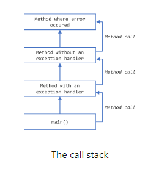
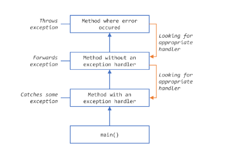

# Exceptions

### What is Exceptions?

The term *exception* is shorthand for the phrase "exceptional event"

----------

*Definition: An exception is an event, which occurs during the execution of a program, that disrupts the normal flow of the program's instructions*

----------

When an error occurs within a method, the method creates an object and hands it off to the runtime system. The object, called an exception object, contains information about the error, including it type and the state of the program when the error occured. Creating an exception object and handing it to the runtime system is called throwing an exception.

After a method throws an exception, the runtime system attempts to find something to handle it. The set of possible "somethings" to handle the exception is the ordered list of methods that had been called to get to the method where the error occured. The list of methods is known as the call stack.

The runtime system searches the call stack for a method that contains a block of code that can handle the exception. This block of code is called an exception handler. The search begins with the method in which the error occurred and proceeds through the call stack in the reverse order in which the methods were called. When an appropriate handler is found, the runtine system passes the exception to the handler. An exception handler is consedered appropriate if the type of the exception object thrown matches the type that can be handled by the handler.

The exception handler chosen is said to catch the exception. If the runtime system exhaustively seraches all the methods on the call stack without finding an appropriate exception handler, as shown below, the runtime system (and, consequently, the program) terminates.

### The Catch or Specify Requirement

The code that might throw certain exceptions must be enclosd by either of the following:

- A `try` statement that catches the exception. The `try` must provide a handler for the exception, as described in Catching and Handling Exceptions.
- A method that specifies that it can throw that exception. The method must be provide a `throws` clause that lists the exception.

### The Three kinds of Exceptions

#### 1. Checked Exception

The first kind of exception is the *checked exception*. These are exceptional conditions that a well-written application should appritiate and recover from.

For example, suppose an application prompts a user for an input file name, then opens hte file by passing the name to the constructor for [java.io.FileReader](https://docs.oracle.com/en/java/javase/22/docs/api/java.base/java/io/FileReader.html). Sometimes the user supplies the name of a nonexistent file, and the constructore throws [java.io.FileNotFoundException](https://docs.oracle.com/en/java/javase/22/docs/api/java.base/java/io/FileNotFoundException.html). A well-written program will catch this exception and notify the user of the mistake possibly prompting for a corrected file name.

Checked exceptions are subject to the Catch or Specify Requirements. All exception are check exceptions, except for those indicated by [Error](https://docs.oracle.com/en/java/javase/22/docs/api/java.base/java/lang/Error.html), [RuntimeException](https://docs.oracle.com/en/java/javase/22/docs/api/java.base/java/lang/RuntimeException.html), and their subclasses.

#### 2. Error

The second kind of exception is the error. These are exceptional conditions that are external to the application, and that the application usually cannot anticipate or recover from. 

For example, suppose that an application successfully opens a file for input, but is unable to read the file because the hardare or system malfunction. The unsuccessfull read will throw [java.io.IOError](https://docs.oracle.com/en/java/javase/22/docs/api/java.base/java/io/IOError.html). An application might choose to catch this exception, in order to notify the user of the problem -- but it also might make sense for the program to print a stack trace and exit.

Errors are not subject to the Catch or Specify Requirement. Errors are those exceptions indicated by [Error](https://docs.oracle.com/en/java/javase/22/docs/api/java.base/java/lang/Error.html) and its subclasses.

#### 3. Runtime Exception

The third kind of exception is the runtime exception. These are excetpional conditions that are internal to the application and that the application usually cannot anticipate or recover from. These usually indicate programing bugs such as logic errors or improper user of an API.

For example, consider the application described precviously that passes a file name to the constructor for [FileReader](https://docs.oracle.com/en/java/javase/22/docs/api/java.base/java/io/FileReader.html). If a logic error causes a `null` to be passed to the constructor, the constructor will throw [NullPointerException](https://docs.oracle.com/en/java/javase/22/docs/api/java.base/java/lang/NullPointerException.html). The application can catch this exception, but it probably makes some sense to elimiate the bug that caused the exception to occur.

Runtime exceptions are not subject to the Catch or Specify Requirement. Runtime exceptions are those indicated by [RuntimeException](https://docs.oracle.com/en/java/javase/22/docs/api/java.base/java/lang/RuntimeException.html) and its subclasses.

Errors and runtime exceptions are collectively known as *unchecked exceptions*.

[<<< Previous](https://) | [Home](../README.md) | [Catching and Handling Exceptions](102-catching-and-handling-exceptions.md)